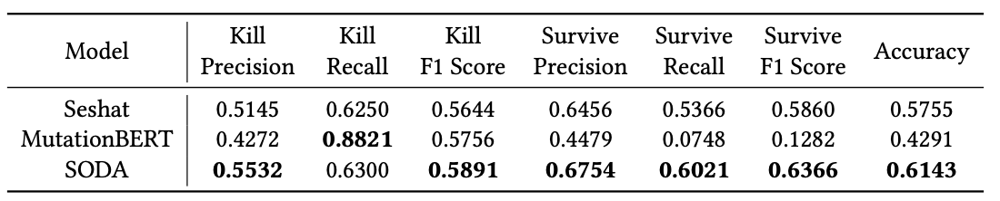

Run test-matrix level PMT evaluation on the [Codec project](https://github.com/apache/commons-codec). We use the previously trained models in the cross-project scenario to run evaluation. More specifically, we use the models trained with Chart, Lang, JacksonCore data since the three projects have the most training samples.

The project and generated mutants info is as follows.

Line of Code: 34,453

Number of Tests: 776

Number of Generated Mutants: 24,823

