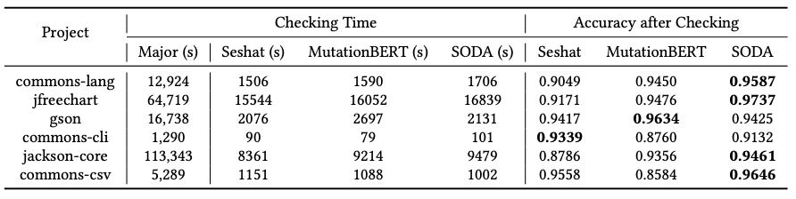

We perform a confirmation check experiment. The checking time equals to PMT method inference time plus the time to run all predicted survived mutants. The three PMT models have comparable checking time.

With confirmation check, SODA achieves the best accuracy among the three PMT models, i.e., an over 90% accuracy on each project, while still has a high speed up (more than 2.8x) compared to Major. 