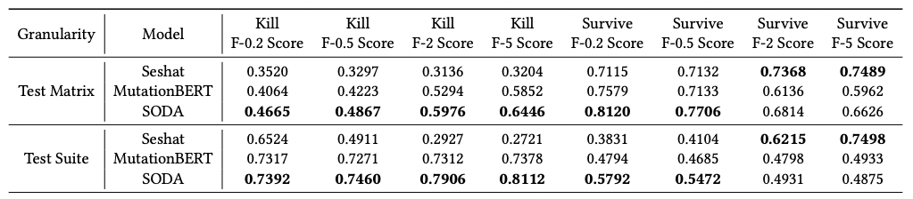

The F-beta value results for the cross-project scenario are shown as follows (f-beta value for Table 3):

From the table, we observe that SODA outperforms the baselines for all Kill F-beta values, but performs worse than Seshat in terms of Survive F-2 Score and Survive F-5 Score. This is as expected, since SODA performs worse than Seshat in terms of survive recall both in test matrix and test suite-level prediction in the cross-project scenario. Although Seshat achieves higher survive recall, its tendency of predicting mutants to be survived due to data imbalance will result in a higher time cost for confirmation checking, which may lead to longer waiting time for developers.
