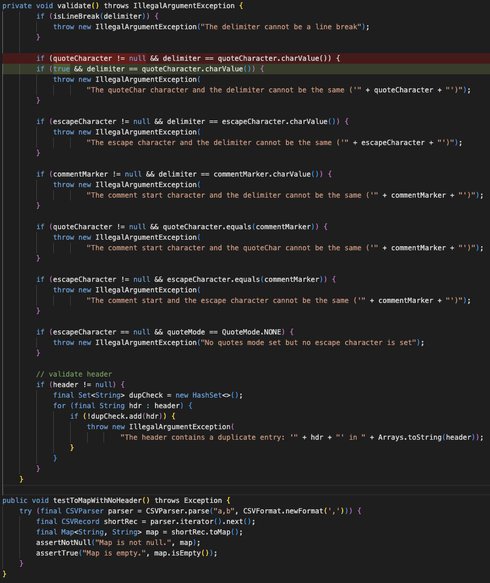
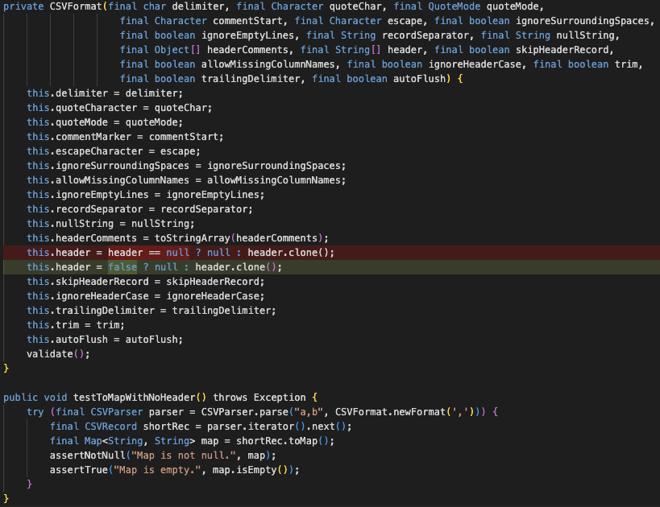
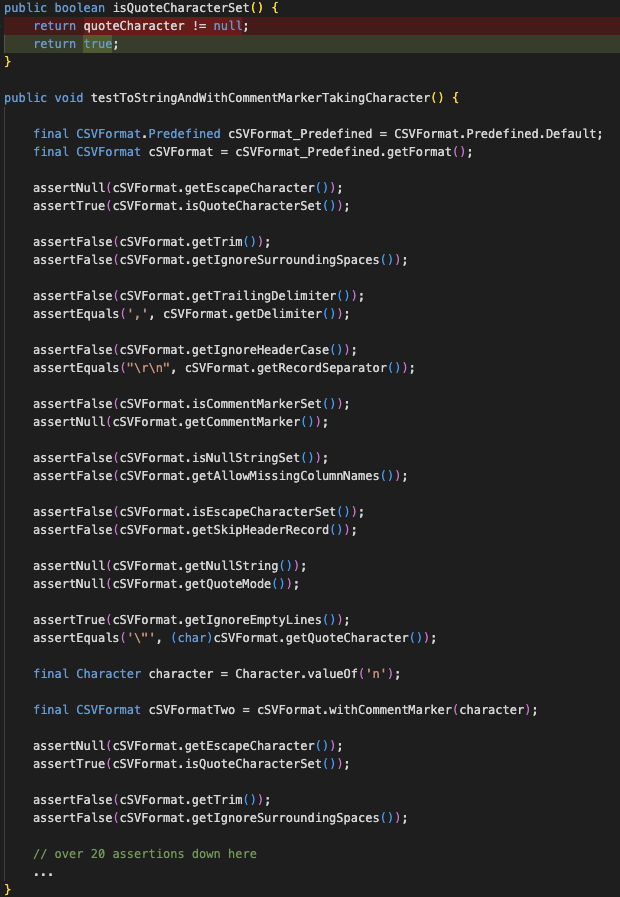

# Case study
#### We show some cases (mutant-test pairs) mispredicted by SODA here. We present the mutated method (the diff is highlighted with red and green line) and the corresponding test.

## Main Reason 1: Not enough context

#### The test constructs a CSVFormat, while the constructor of CSVFormat invoke the mutated method validate(). However, the source code of CSVFormat is not included as input. Therefore, it is hard for SODA to establish connection between the test and the method. Therefore, how to incorporate more valuable context information with a limit on the number of tokens is a promising direction.

## Main Reason 2: Missed clue

#### The test constructs a CSVFormat with its header uninitialized. The mutated part of the method will result in cloning a null pointer, which then will throw a NullPointerException. However, SODA fails to see this clue. Therefore, SODA still needs to improve its understanding of program semantics.

## Minor Reason: Too many assertions

#### There are too many assertions in one test, which may confuse SODA which one could detects the changed program behaviour.