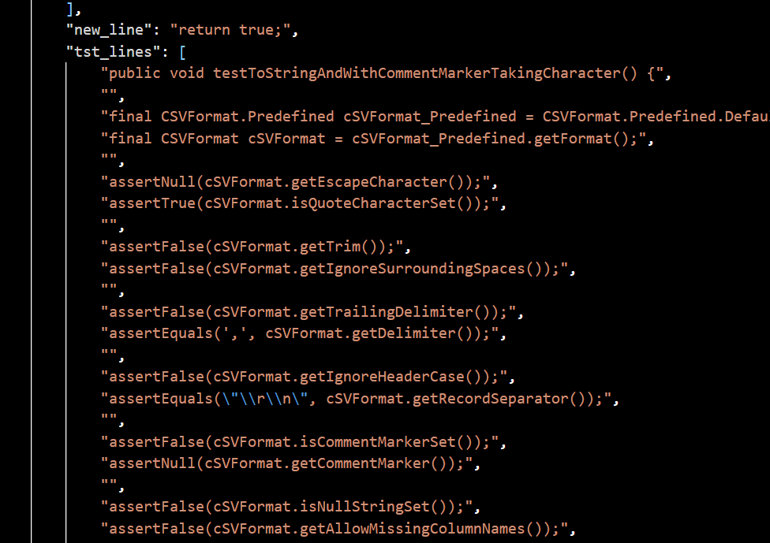

# Case study
## Not enough context

The test constructs a CSVParser, while the constructor of CSVParser invoke the mutated method validate(). However, the source code of CSVParser is not included as input. Therefore, it is hard for SODA to establish connection between test and method.

## Missed clue

The test constructs a CSVFormat with its header intializes to null. The mutated part of the method will result in cloning a null pointer, which then leads to a NullPointerException. However, SODA fails to see this clue.

## Too many assertions

There are too many assertions in one test, which may confuse SODA.