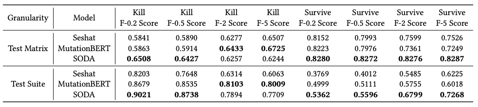

The details of the version for each project we use is as follows:  

| Project     | Commit ID   | Date       |
|-------------|-------------|------------|
| commons-cli     | b1b1fff     | 2022-09-25 |
| jackson-core     | 4f95115    | 2022-06-22 |
| gson              | dc28951   | 2021-12-31 |
| jfreechart        | 2a8ded9   | 2020-10-03 |
| commons-csv    | 6aa1756      | 2019-09-29 |
| commons-lang   | eb5b11a      | 2018-09-19 |

The f-beta value results are shown as follows:
