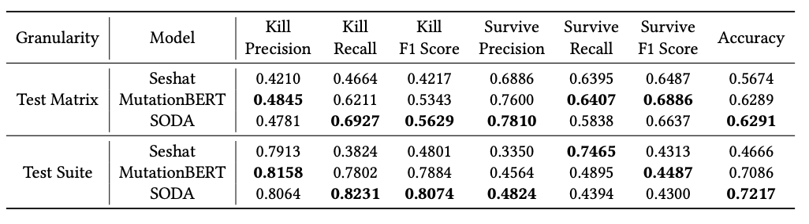

The details of the version for each project we use is as follows:  

| Project     | Commit ID   | Date       |
|-------------|-------------|------------|
| commons-cli     | b1b1fff     | 2022-09-25 |
| jackson-core     | 4f95115    | 2022-06-22 |
| gson              | dc28951   | 2021-12-31 |
| jfreechart        | 2a8ded9   | 2020-10-03 |
| commons-csv    | 6aa1756      | 2019-09-29 |
| commons-lang   | eb5b11a      | 2018-09-19 |

The f-beta score for cross-version scenario (evaluated with models trained in RQ1) are shown as follows:

The kill, recall, and F1-score for cross-project scenario (evaluated with models trained in RQ2) are shown as follows:

The f-beta score for cross-project scenario (evaluated with models trained in RQ2) are shown as follows:

Compared with Table 3 (cross-project results in RQ2), SODA's prediction performance also declines. Evaluation on the newer versions for cross-project scenario is the most difficult, since the training data come from older versions of other projects. Therefore, the training data and testing data have very different distributions, both because of time span and project characteristics. Therefore, the knowledge acquired from the training data inherently has limited applicability to the testing data, which restricts the improvement of SODA’s performance.