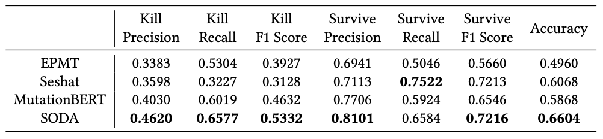

We provide the test matrix-level results of a simple baseline, EPMT (Ensemble-based PMT, published in STVR'21), here (in the cross-project scenario). For ease of comparison, we also include the results for Seshat, MutationBERT, SODA in Table 3.

